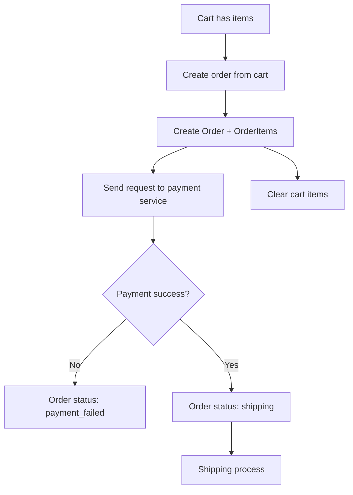

# E_commerce

## Run with Docker

1. Copy `.env.example` to `.env` and adjust values if needed.
2. Start the containers:

    ```bash
    docker compose up --build
    ```

3. Open the services:
    - Django web app: http://localhost:8000
    - AI FastAPI service: http://localhost:8001
    - Product service: http://localhost:8002
    - User service: http://localhost:8003
    - Cart service: http://localhost:8004
    - Order service: http://localhost:8005
    - Payment service: http://localhost:8006
    - Shipping service: http://localhost:8007

Note: the containers currently share SQLite, which is not safe for concurrent writes. For real multi-container usage, switch to Postgres/MySQL.

## LSTM Training (AI Service)

Train and run a demo prediction (uses data/user_behavior_sessions.csv by default):

```bash
python ai_service/lstm/train_and_predict.py --user-id 1
```

Generate fake data and run:

```bash
python ai_service/lstm/train_and_predict.py --generate-fake --user-id 1
```

## Order Service Workflow


