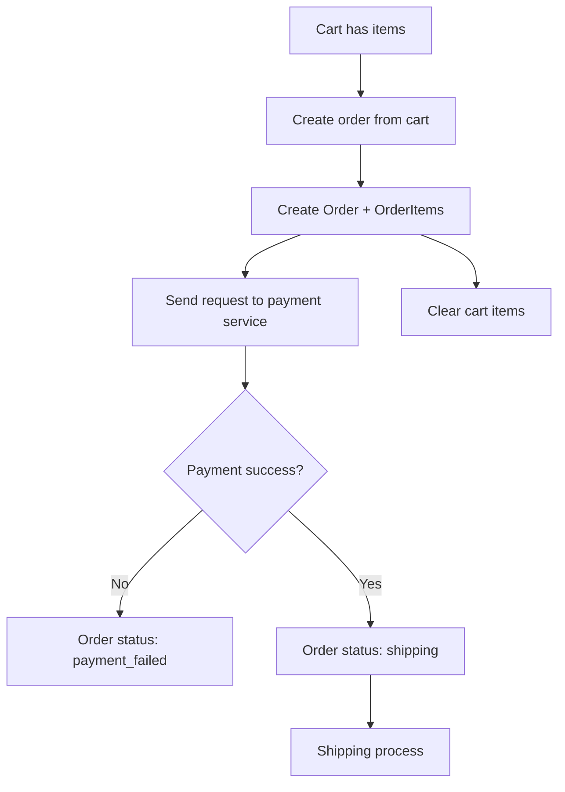

# E_commerce

## Order Service Workflow

```mermaid
flowchart TD
    A[Cart has items] --> B[Create order from cart]
    B --> C[Create Order + OrderItems]
    C --> D[Send request to payment service]
    D --> E{Payment success?}
    E -- No --> F[Order status: payment_failed]
    E -- Yes --> G[Order status: shipping]
    G --> H[Shipping process]
    C --> I[Clear cart items]
```
